# Open Addressing Removals: Tombstones and Lazy Relocation

## 1. What This Document Covers

This document explains why element removal is difficult in open addressing hash tables and how tombstones and lazy relocation solve it.

It is written to be easy to revisit later:

- key concepts are defined clearly,
- examples show exact array states,
- algorithm behavior is explained step-by-step,
- and the relationship between search, remove, and insert is made explicit.

## 2. Open Addressing Basics

In open addressing, keys are stored directly in the hash table array.

When a key collides with an occupied index, the table finds another index using a probe sequence.

Common probe strategies:

- Linear probing: `index = (h + x) mod N`
- Quadratic probing: `index = (h + x*x + x) / 2 mod N`
- Double hashing: `index = (h1 + x * h2) mod N`

Important property:

- A search for a key follows the same probe sequence used during insertion.
- The search stops when it finds the key or when it sees a null slot.

## 3. Why Naive Removal Breaks Search

If a bucket is cleared to null during deletion, it may prematurely terminate later searches.

### Example: linear probing

Assume a table of size 6 and these values:

```
Index: 0  1   2   3  4  5
Value: -  K1  K2  K3 -  -
```

Insertion order:

1. `K1` hashes to index `1` and is placed there.
2. `K2` also hashes to index `1`, so it moves to index `2`.
3. `K3` also hashes to index `1`, so it moves to index `3`.

This creates a probe chain for all keys starting at index `1`.

### Remove `K2` naively

If we remove `K2` by setting index `2` to null:

```
Index: 0  1   2   3  4  5
Value: -  K1   -  K3 -  -
```

Search for `K3`:

1. Compute the initial index: `1`.
2. At index `1`, see `K1` (not `K3`).
3. Probe to index `2`.
4. At index `2`, see null.
5. Stop search and conclude `K3` is not present.

This is wrong because `K3` is still at index `3`.

### Why the chain breaks

The null value is interpreted as "the key is not in the table." But in open addressing, a null in the middle of a chain can only occur when the key is truly absent.

Removing an element by setting null destroys the chain.


## 4. Tombstones: Correct Deletion

A tombstone is a special marker that means "this slot used to contain a key, but it has been deleted." It preserves the probe chain.

### Tombstone rules

- For search: tombstones behave like occupied slots.
  - The search does not stop at a tombstone.
  - The search continues probing.
- For insertion: tombstones behave like free slots.
  - The insert may reuse the tombstone slot.

### Why tombstones preserve correctness

With tombstones, the search does not misinterpret deleted positions as the end of the chain.

Example after deleting `K2`:

```
Index: 0  1   2        3  4  5
Value: -  K1  TOMB  K3 -  -
```

Search for `K3`:

1. Start at index `1`.
2. See `K1`.
3. Go to index `2`.
4. See `TOMB` and keep searching.
5. Find `K3` at index `3`.

This is correct because tombstones keep the chain alive.


## 5. What Tombstones Cost

Tombstones solve the correctness problem, but they are not free.

### Cost 1: longer search time

Tombstones increase the number of slots a search must examine.

A search passes through tombstones the same way it passes through normal keys.

### Cost 2: reduced effective free space

Even though a tombstone can be reused, it still counts as part of the occupied probe chain.

This means the table can appear fuller than it actually is.

### Cost 3: potential clustering

Tombstones contribute to clustering because they occupy positions that might otherwise break long probe chains.

## 6. Managing Tombstones

There are two common ways to manage tombstones:

### 6.1 Reuse tombstones during insertion

When inserting a key, keep track of the first tombstone seen.

- If the key is found later in the probe sequence, do not insert.
- If a null slot is found and a tombstone was recorded, insert into the tombstone slot.
- If no tombstone was recorded, insert into the null slot.

This reclaims space immediately.

### 6.2 Clear tombstones when resizing

When the table grows or is rebuilt, tombstones are discarded.

Resizing process:

1. Allocate a new prime-sized table.
2. Rehash every live key from the old table into the new table.
3. Do not copy tombstones.

This purges all tombstones and restores good performance.

## 7. Lazy Relocation: Cleaner Search Chains

Lazy relocation is an optimization that cleans up tombstones during a successful search.

It moves a found key backward into the first tombstone encountered earlier in the probe chain.

### Why lazy relocation helps

- It shortens future searches for that key.
- It reduces tombstone clutter over time.
- It keeps the table closer to its ideal probe structure.

### Process in detail

Assume we are searching for a key and the table may contain tombstones.

1. Start probing from the initial hash index.
2. If a tombstone is encountered and none has been recorded yet, remember its position.
3. Continue probing until the key is found or a null slot is reached.
4. If the key is found and a tombstone was recorded:
   - Move the key-value pair into the first tombstone slot.
   - Set the old key slot to null.

This does not change correctness because the key is still reachable via the same probe sequence.

### Example with quadratic probing

Suppose the table has size `8` and uses this probe formula:

`index = (hash + x*x + x) / 2 mod 8`

Current array state:

```
Index: 0  1        2  3   4  5   6        7
Value: -  TOMB  -  K7  -  K4  TOMB  -
```

Search for `K7`:

- Start at index `5`: see `K4`.
- Next index `6`: see `TOMB`; record index `6`.
- Next index `1`: see `TOMB`; keep searching.
- Next index `3`: find `K7`.

Relocate `K7`:

- Move `K7` into index `6`.
- Set index `3` to null.

After relocation:

```
Index: 0  1        2  3  4  5   6   7
Value: -  TOMB  -  -  -  K4  K7  -
```

The next search for `K7` will stop at index `6`, which is closer to the start of the chain.


## 8. Exact Behaviors by Operation

### 8.1 Search operation

- Probe the table using the key's hash and the chosen probe function.
- If the slot contains the key, return success.
- If the slot contains `null`, return failure.
- If the slot contains a tombstone or another key, continue probing.

### 8.2 Insert operation

- Probe the table using the key's hash.
- Track the first tombstone found, if any.
- If the key is found, update or return existing.
- If a null slot is found:
  - Insert at the first recorded tombstone if one exists.
  - Otherwise insert at the null slot.

### 8.3 Delete operation

- Probe the table until the key is found or a null slot appears.
- If the key is found, replace it with a tombstone.
- If a null slot appears first, the key is not present.

## 9. Practical Guidelines for Future Use

When you revisit this file later, remember these points:

- Open addressing relies on probe chains.
- Null means "stop searching." Tombstone means "keep searching." 
- Deleting by null is only safe if the slot is at the end of the chain.
- Tombstones preserve correctness but should be cleaned up over time.
- Lazy relocation is a good optimization when reads are frequent.
- Table rebuilds are the best time to remove all tombstones.

## 10. Full Process Diagram

```mermaid
flowchart TB
  A[Start operation] --> B{Operation type?}
  B -- Search --> C[Probe until key or null]
  C --> D{Slot contains tombstone?}
  D -- Yes --> E[Continue searching]
  D -- No --> F{Slot contains key?}
  F -- Yes --> G[Return found]
  F -- No --> H{Slot is null?}
  H -- Yes --> I[Return not found]
  H -- No --> E
  B -- Insert --> J[Probe until key, tombstone, or null]
  J --> K{Slot contains key?}
  K -- Yes --> L[Return/update existing]
  K -- No --> M{Found tombstone earlier?}
  M -- Yes --> N[Insert into first tombstone]
  M -- No --> O[Insert into null slot]
  B -- Delete --> P[Probe until key or null]
  P --> Q{Slot contains key?}
  Q -- Yes --> R[Mark as tombstone]
  Q -- No --> S[Return not found]
```


